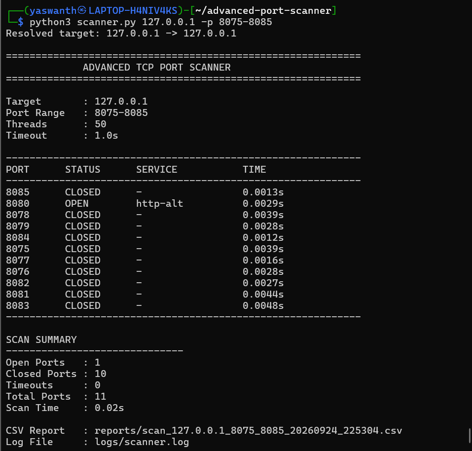

# Advanced TCP Port Scanner

A Python-based TCP port scanner developed for authorized network security testing and learning.

## Features

- TCP port scanning
- Single-host scanning
- Custom port-range scanning
- Multithreaded scanning
- Open port detection
- Closed port detection
- Timeout detection
- Basic service identification
- Scan result logging
- CSV report generation
- Exception handling
- Configurable timeout
- Configurable thread count

## Technologies

- Python 3
- Socket Programming
- ThreadPoolExecutor
- TCP/IP
- CSV
- Logging

## Project Structure

advanced-port-scanner/
│
├── scanner.py
├── requirements.txt
├── README.md
├── .gitignore
│
├── logs/
│   └── scanner.log
│
└── reports/
    └── scan_results.csv

## Successful Scan

The scanner was tested against a local authorized HTTP server running on `127.0.0.1:8080`.



## Installation

Clone the repository:

```bash
git clone <repository-url>
cd advanced-port-scanner
